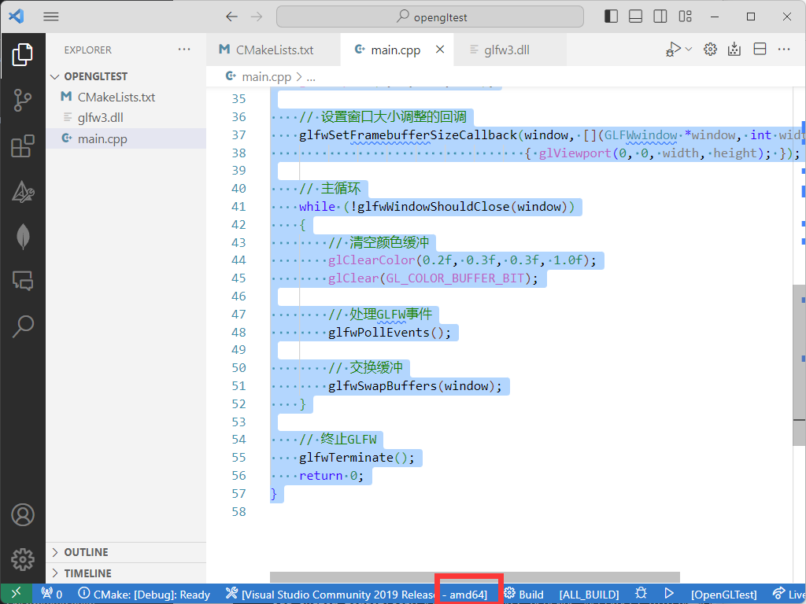

# 使用vscode安装glfw和glad

本教程使用vscode的cmake插件编写代码，需要同学自己写cmakelist编译cpp文件，免去visual studio链接库的烦恼。
主要流程如下:

1. 安装vscode，cmake
2. 安装vcpkg
3. 使用vcpkg安装glad glfw
4. 编写cmakelist
5. 编写cpp代码
6. 编译运行


## 安装vscode和cmake
这一步很简单，直接去官网下载安装即可。
vscode要装c++和cmake插件。  


## 安装vcpkg

### Step 1: Clone the vcpkg repo
```
git clone https://github.com/Microsoft/vcpkg.git
```
Make sure you are in the directory you want the tool installed to before doing this.

### Step 2: Run the bootstrap script to build vcpkg
```
cd vcpkg
.\vcpkg\bootstrap-vcpkg.bat
```
<a name="section3"></a>  
## 使用vcpkg安装glad glfw

Go to the vcpkg directory and run:
```
.\vcpkg install glad
.\vcpkg install glfw3
```
检查glad，glfw是否安装成功，可以在vcpkg目录下的installed目录下查看。


## 创建项目，编写CMakelists
在vscode中创建一个文件夹，然后在文件夹中创建一个CMakelists.txt文件，内容如下：
```cmake
# 设置CMake的最低版本要求
cmake_minimum_required(VERSION 3.10)

# 项目名称定义
project(OpenGLTest)

# --- VCPKG集成开始 ---
# 设置vcpkg的工具链文件路径，这样CMake可以找到vcpkg提供的库和工具。
# 注意: 请确保以下路径正确地指向了您的vcpkg的工具链文件。
# 如果您和他人共享此CMakeLists.txt，请确保他们更新此路径以匹配其vcpkg安装。
set(CMAKE_TOOLCHAIN_FILE [请替换为您的vcpkg路径]/scripts/buildsystems/vcpkg.cmake)

# 为find_package()设置路径，确保它可以找到vcpkg的包配置文件。
set(CMAKE_PREFIX_PATH [请替换为您的vcpkg路径]/installed/x64-windows/share)
# --- VCPKG集成结束 ---

# 定义项目的可执行文件
add_executable(OpenGLTest main.cpp)

# 寻找并链接glad库
find_package(glad CONFIG REQUIRED)
target_link_libraries(${PROJECT_NAME} PRIVATE glad::glad)

# 寻找并链接glfw3库
find_package(glfw3 CONFIG REQUIRED)
target_link_libraries(${PROJECT_NAME} PRIVATE glfw)

```

## 编写cpp代码
在CMakelists.txt同级目录下创建main.cpp文件，内容如下：
```cpp
#include <glad/glad.h>
#include <GLFW/glfw3.h>
#include <iostream>

int main()
{
    // 初始化GLFW
    if (!glfwInit())
    {
        std::cerr << "Failed to initialize GLFW!" << std::endl;
        return -1;
    }

    // 创建窗口
    GLFWwindow *window = glfwCreateWindow(800, 600, "GLFW Window", nullptr, nullptr);
    if (!window)
    {
        std::cerr << "Failed to create GLFW window!" << std::endl;
        glfwTerminate();
        return -1;
    }

    // 将窗口的上下文设置为当前线程的主上下文
    glfwMakeContextCurrent(window);

    // 初始化GLAD
    if (!gladLoadGLLoader((GLADloadproc)glfwGetProcAddress))
    {
        std::cerr << "Failed to initialize GLAD!" << std::endl;
        return -1;
    }

    // 设置视口大小
    glViewport(0, 0, 800, 600);

    // 设置窗口大小调整的回调
    glfwSetFramebufferSizeCallback(window, [](GLFWwindow *window, int width, int height)
                                   { glViewport(0, 0, width, height); });

    // 主循环
    while (!glfwWindowShouldClose(window))
    {
        // 清空颜色缓冲
        glClearColor(0.2f, 0.3f, 0.3f, 1.0f);
        glClear(GL_COLOR_BUFFER_BIT);

        // 处理GLFW事件
        glfwPollEvents();

        // 交换缓冲
        glfwSwapBuffers(window);
    }

    // 终止GLFW
    glfwTerminate();
    return 0;
}
```

## 编译运行
如果在vscode里安装了cmake插件，下面会有几个按钮，选择x64模式



点击齿轮按钮就可以build了，记得先保存CMakelists.txt和main.cpp文件，编译成功后会在终端显示如下信息：
```
[build] Build finished with exit code 0
```
如果exit code不是0，说明编译失败，需要检查Output里的错误信息，根据错误信息修改代码。

编译成功后会在当前目录下生成一个build文件夹，里面有一个exe文件，**使用文件资源管理器打开**，双击打开运行。


我们缺少glfw3.dll文件，需要将vcpkg目录下的installed目录下的x64-windows的bin目录下的glfw3.dll文件复制到exe文件所在的目录下，然后再次双击运行，就可以看到一个窗口了。
